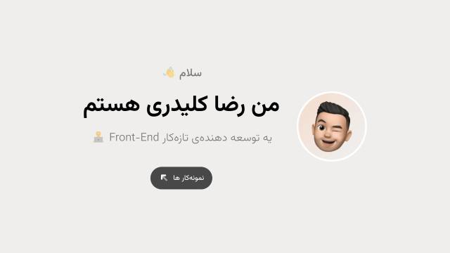

# Hi 👋

I’m @reza-kelidari, a junior Front-End devloper, and this is my portfolio project

# My skills 🔬

I can write Front-End projects using `Next.JS`, `React.JS`, `TypeScript`, `Sass`, and more.

# My projects 🧑‍💻

Here is some of my projects for my portfolio:

### Portfolio

This is my portfolio, made with `Next.JS`, `Type Script`, `Sass`.

#### Links

- Github Project: [@reza-kelidari/reza-kelidari](https://github.com/reza-kelidari/reza-kelidari)

- Demo: [https://reza-kelidari.github.io/reza-kelidari](https://reza-kelidari.github.io/reza-kelidari)

### Ashiooneh

Ashiooneh is a online real state website, made with `React.JS`, `Type Script`, `Sass`.

#### Links

- Github Project: [@reza-kelidari/ashiooneh](https://github.com/reza-kelidari/ashiooneh)

- Demo: [https://ashiooneh.vercel.app/](https://ashiooneh-git-main-reza-kelidaris-projects-e284196b.vercel.app/)

### Doctore To

Doctore To is a online medical website, made with `React.JS`, `Type Script`, `Sass`.

#### Links

- Github Project: [@reza-kelidari/doctore-to](https://github.com/reza-kelidari/doctore-to)

- Demo: [https://doctore-to.vercel.app/](https://doctore-to-git-main-reza-kelidaris-projects-e284196b.vercel.app/)

### Movie Land

Movie Land is a online movie database website, made with `React.JS`, `Type Script`, `Sass`.

#### Links

- Github Project: [@reza-kelidari/movie-land](https://github.com/reza-kelidari/movie-land)

- Demo: [https://movie-land.vercel.app/](https://movie-land-git-master-reza-kelidaris-projects-e284196b.vercel.app/)
  - Used API is `themoviedb.org` that needs VPN or DNS Changing somethimes

### Form Validator

Form Validatior is a multi step authentication form with validation website, made with `React.JS`, `Type Script`, `Sass`, `Firebase`.

#### Links

- Github Project: [@reza-kelidari/form-validator](https://github.com/reza-kelidari/form-validator)

- Demo: [https://form-validator.vercel.app/](https://form-validator-git-master-reza-kelidaris-projects-e284196b.vercel.app/)
